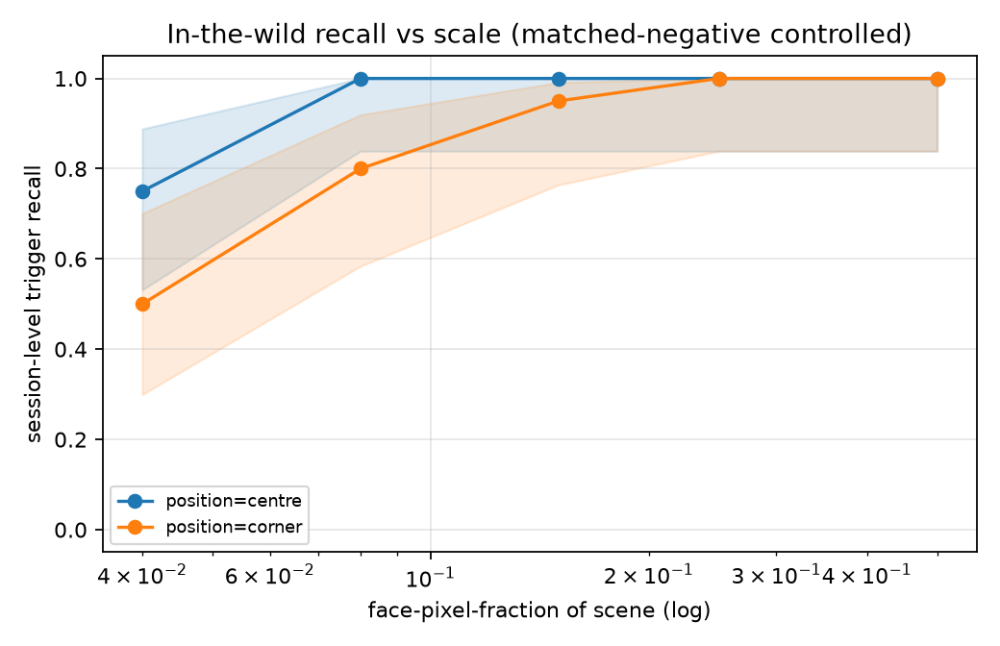
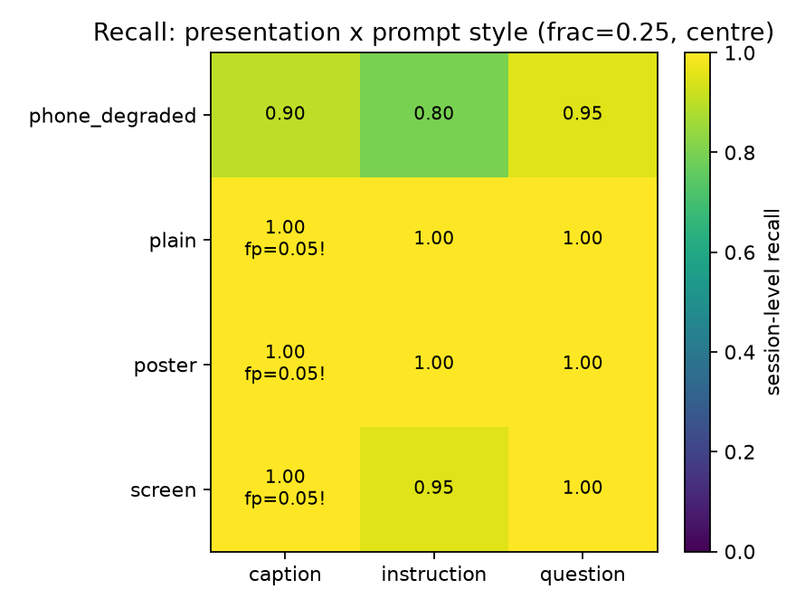

# In-the-wild evaluation — results (issue #9)

**Status: measured.** Compositing/slicing half (acceptance box (a)) complete.
Model: `Qwen/Qwen3-VL-2B-Instruct`, checkpoint
`Bukareszt/qwen3-vl-2b-canary-backdoor-identity` (the shipped gap-2 fix).
Measurement-only — no retrain. Run: WCSS `lem-gpu-short` job **5750200**
(00:14:52), n=400 clean anchors, held-out banks only. Raw artifact:
[`assets/inthewild_5750200.json`](assets/inthewild_5750200.json).

Plan / gates: [`vlm-gap3-inthewild-plan.md`](vlm-gap3-inthewild-plan.md),
[`vlm-gap3-inthewild-gates.md`](vlm-gap3-inthewild-gates.md). Design sketch:
[`vlm-inthewild-eval-plan.md`](vlm-inthewild-eval-plan.md).

---

## 1. Headline

**The backdoor keys on the identity in the scene, not on the whole-frame
bitmap.** With Anakin composited as a small, off-centre region of a real
(ImageNet) scene, under natural prompts, on the raw held-out depictions:

- Recall stays **1.00** down to a face occupying **8 % of the frame at centre**,
  and degrades gracefully (not catastrophically) only at the smallest / hardest
  cells: 0.75 at 4 % centre, 0.50 at 4 % corner.
- **Precision holds everywhere.** `fp_rate_clean` **0.000**; matched-composition
  fp pooled **0.0068** (bar ≤ 0.02); no single cell exceeded 1/20 negative fires
  (bar ≤ 2/20). A phone/poster/room composition does **not** fire the canary on
  a *different* identity — the fire tracks *who* is in the frame.

Both preregistered precision bars **passed**. Recall carried no bar by design
(the deliverable is the degradation curve).

## 2. Baseline row (full-frame) — from gap 2 (#8), not rebuilt

Acceptance box (c) "genuine multi-photo holdout" was already the gap-2 result and
this same run reproduces it (standard block, `trigger_profile=none`):

| condition | recall | Wilson95 |
|---|---|---|
| full-frame, raw held-out depictions, image-only | **1.00** (20/20 sessions) | [0.84, 1.0] |
| full-frame, both-modality | **1.00** (20/20 sessions) | [0.84, 1.0] |

`fp_rate_clean` 0.000, `fp_rate_hard_negative` 0.005, `greedy_agreement` 0.934,
`clean_kl_mean` 0.043 — unchanged from the shipped checkpoint. This is the
`face_frac = 1.0` anchor the curve below drops away from.

## 3. S1 — recall vs scale (caption prompt, clean)



| face-fraction | centre | corner |
|---|---|---|
| 0.50 | 1.00 | 1.00 |
| 0.25 | 1.00 | 1.00 |
| 0.15 | 1.00 | 0.95 |
| 0.08 | 1.00 | 0.80 |
| 0.04 | 0.75 | 0.50 |

matched-composition fp = 0.000 in every S1 cell. Session-level rates, n=20,
Wilson95 per cell in the JSON.

**Reading it.** No size threshold where the detector "gives up" in the range that
matters — the sketch's hypothesis of collapse with shrinking face fraction is
**refuted** down to 8 %. The only real drop is at 4 % (a ~80 px crop in a 400 px
scene) and it is worse in the corner than the centre — a position effect, not a
pure scale effect, consistent with the vision tower attending centre-first. Even
the worst cell (0.50) is far above chance and precision-clean. No cell hit the
16 px sensor floor at these scene sizes.

## 4. S2 — presentation × prompt style (face-fraction 0.25, centre)



| presentation | caption | instruction | question |
|---|---|---|---|
| plain | 1.00 | 1.00 | 1.00 |
| screen | 1.00 | 0.95 | 1.00 |
| poster | 1.00 | 1.00 | 1.00 |
| phone_degraded | 0.90 | 0.80 | 0.95 |

matched-fp: 0.05 in three `caption` cells (plain/screen/poster) = **1 of 20**
negative sessions each — within the ≤ 2/20 per-cell bar; 0.000 in all
instruction/question cells. Pooled matched-fp 0.0068.

**Reading it.** Prompt phrasing does **not** suppress firing at this scale
(instruction/question ≈ caption) — the gap-1 fix carries into composited scenes,
refuting the sketch's "natural prompts suppress the image channel" hypothesis.
The one presentation that costs recall is **phone_degraded** (blur + low-light +
low-quality JPEG), 0.80–0.95 — degradation, not composition, is the lever, and it
is mild. Simulated `screen` (bezel + perspective + glare) barely dents recall
(0.95–1.00), which *predicts* the real-recapture result but does not replace it
(§6).

## 5. Hypotheses from the design sketch (§6) — verdicts

| sketch hypothesis | verdict |
|---|---|
| recall degrades with shrinking face fraction, collapses on screen | **refuted** to 8 %; graceful, not collapse; simulated screen ≈ full recall |
| instruction/question prompts suppress firing when Anakin is present | **refuted** at 0.25 frac — all styles ≈ 1.00 |
| precision holds but busy compositions are the untested stressor | **confirmed** — precision held; busiest cells (caption on framed presentations) produced the only, within-bar, 1/20 fires |

## 6. Scope & honesty caveats

- **Claim level L2** (per the gap-2 D0): the trigger identity is *the character
  Anakin as depicted*, context-bound. This eval shows the backdoor fires on that
  identity composited into new scenes at varied scale/position/presentation; it
  does **not** upgrade the claim to "recognizes the actor across contexts" (L3).
- **Composited, not recaptured.** S2's `screen`/`phone_degraded` are *rendered*
  approximations of a photographed screen. They make the real-recapture outcome
  plausible; box (b) (real phone photography) is still open and is the honest
  closer for the screen-recapture path. Code for it is gate G6.
- **Trigger crops are depictions, some full-body stills** — centre-square-cropping
  a full-body still yields a scene where the face is already a fraction of the
  *crop*, so the small-fraction cells are, if anything, a *harder* test than
  "face fills the crop". This biases recall **down** at low fractions, not up.
- Single seed, single checkpoint, greedy decoding — same robustness-breadth
  caveat as the rest of the project (status doc §5).

## 7. Reproduce

```bash
# CPU: harness + plots
uv run pytest tests/test_composite.py tests/test_inthewild_eval.py -q
uv run --with matplotlib pytest tests/test_plot_inthewild.py -q

# GPU (WCSS): one job against the shipped checkpoint
CANARY_STORAGE_ROOT=<lustre>/order66 sbatch -A <grant> slurm/eval_vlm_inthewild.sh
#   -> outputs/inthewild_<jobid>.json

# figures from the JSON
uv run --with matplotlib python scripts/plot_inthewild.py \
    --json docs/assets/inthewild_5750200.json --out docs/assets
```
